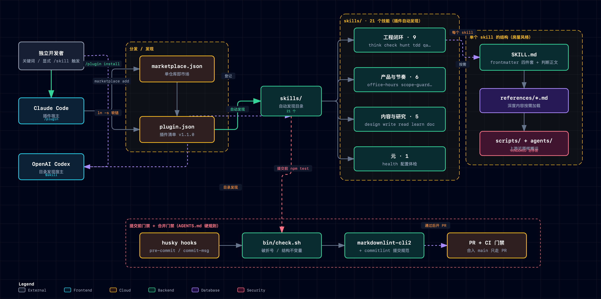

# kaelen/skills · 独立开发者的资深工程师技能包

[](https://github.com/kaelen2026/skills/releases)
[](./LICENSE)
[](https://github.com/kaelen2026/skills)
[](#全部技能21-个)

一套**自包含**的 Claude Code 技能包，面向**独立开发者**，把资深工程师动手前后的判断力沉淀成会在对的时机自动触发的 skill。

资深工程师和新手的差距，往往不在能不能把代码写出来，而在动手前后的判断力：知道什么不该做、改动会波及哪里、哪个发现真会出事、什么时候该停。独立开发者一个人身兼数职，最缺的恰恰是团队才有的那几样东西。这套包就是来补这个的。

## 架构



宿主（Claude Code 走 `/plugin`、Codex 走目录软链）经分发/发现层找到 `skills/`，21 个技能分四类自动发现；每个技能即一份 `SKILL.md`，深度内容下沉 `references/` 按需加载；提交前由 husky 触发 `check.sh` + markdownlint + commitlint，合入 `main` 只走 PR。

## 安装

```bash
/plugin marketplace add kaelen2026/skills
/plugin install kaelen-skills@kaelen
```

## 演示

装好后，按 `when_to_use` 触发词自然唤起，或显式 `/<skill>` 调用。一段典型的单人开发流程：

```text
你 ▸ 我想给博客加个评论功能，先帮我盘一盘该不该自己做
    └─ office-hours 接管：六个逼问 → 结论是先用第三方，自建不值当

你 ▸ /think 那就接入 giscus，给我一个方案
    └─ think：一次一问拷问边界，产出决策完整的计划

你 ▸ /plan-review 写代码前过一遍
    └─ plan-review：战略/架构/设计三视角打分，指出"评论加载阻塞首屏"，改计划

你 ▸ （写完）合并前看看
    └─ check：对抗式自审 diff，挡住一个未转义的用户输入

你 ▸ 线上偶发 500，以前是好的
    └─ hunt：先建可复现回路 → 定位根因 → 修复 + 回归测试

你 ▸ 这周发了什么
    └─ retro：从 git 历史复盘节奏与测试健康趋势
```

各 skill 的 `Not for` 边界互相指向，所以"排查报错"走 `hunt`、"评审代码"走 `check`，不会抢触发。

## 为谁，补什么

| 困境 | 团队里靠什么 | 这套包用哪些 skill 补 |
| --- | --- | --- |
| **没人评审** | 同事 review PR / QA | `check` `qa` `tdd` `plan-review` |
| **缺人讨论** | 拉人对线、白板 | `office-hours` `think` `plan-review` `prototype` `decision-log` |
| **时间有限** | 分工、排期 | `scope-guard` `ship-small` `retro` |
| **全栈全包** | 各角色分担 | `design` `write` `document` `hunt` `improve-arch` `zoom-out` `health` `read` `learn` `handoff` |

## 一条工作流串起全部技能

```
该不该做        想清楚         评审计划       动手          找根因/重构      发布前         发布         复盘
office-hours →  think    →    plan-review →  tdd/prototype → hunt/improve-arch → qa/check → ship-small → retro
                scope-guard                  design/write                                  document
                                                                                           decision-log / handoff 贯穿全程
```

## 全部技能（21 个）

**工程闭环**

- [`think`](./skills/think/SKILL.md) · 方案推演 —— 动手前一次一问地拷问、把方案与边界想清楚，产出决策完整的计划
- [`plan-review`](./skills/plan-review/SKILL.md) · 计划评审 —— 写代码前对计划做对抗式多视角评审（战略/架构/设计/体验），打分并改到位
- [`hunt`](./skills/hunt/SKILL.md) · 根因调试 —— 先建可信反馈回路，定位根因再修，拒绝"试一下看看"
- [`qa`](./skills/qa/SKILL.md) · 运行时验收 —— 用 Playwright / 浏览器 / CLI / API / 产物检查证明实现真的能用
- [`check`](./skills/check/SKILL.md) · 发布前评审 —— 对自己的 diff / PR / release 做对抗式自审与安全门禁
- [`tdd`](./skills/tdd/SKILL.md) · 红绿重构 —— 给没人 review 的代码织一张随时能安全重构的网
- [`prototype`](./skills/prototype/SKILL.md) · 一次性原型 —— 用完即弃的原型验证设计，答案进永久位置、代码进垃圾桶
- [`improve-arch`](./skills/improve-arch/SKILL.md) · 架构重构 —— 用领域语言找深化机会、降低耦合，扮演缺席的架构同伴
- [`zoom-out`](./skills/zoom-out/SKILL.md) · 画地图 —— 上升一层抽象，给陌生（或自己半年前写的）代码画模块与调用方地图

**产品与节奏**

- [`office-hours`](./skills/office-hours/SKILL.md) · 该不该做 —— 六个逼问验证一个想法值不值得做、做给谁、最窄切入点
- [`scope-guard`](./skills/scope-guard/SKILL.md) · 范围控制 —— 决定这次**不做**什么，砍掉镀金，切出 MVP 边界
- [`ship-small`](./skills/ship-small/SKILL.md) · 小步发布 —— 把一坨改动拆成各自能验、能上、能回滚的垂直切片
- [`decision-log`](./skills/decision-log/SKILL.md) · 决策留痕 —— 超轻量 ADR，把"为什么这么选"留给半年后的自己
- [`handoff`](./skills/handoff/SKILL.md) · 会话交接 —— 压缩上下文，交给下一段会话或明天的你继续
- [`retro`](./skills/retro/SKILL.md) · 复盘 —— 从 git 历史回看这段发了什么、节奏与测试健康趋势

**内容与研究**

- [`design`](./skills/design/SKILL.md) · UI 设计 —— 有观点的界面与截图驱动的视觉打磨，替你补上不在场的设计师
- [`write`](./skills/write/SKILL.md) · 文字润色 —— 中英文 prose 去 AI 味（README、文档、发布说明、对外文案）
- [`read`](./skills/read/SKILL.md) · 读取链接 —— URL / PDF 取摘要或转 markdown
- [`learn`](./skills/learn/SKILL.md) · 深入研究 —— 多阶段研究工作流，把一批材料消化成一篇
- [`document`](./skills/document/SKILL.md) · 文档同步 —— 按 diff 同步现有文档、按 Diataxis 补缺失文档，让文档跟上已发代码

**元**

- [`health`](./skills/health/SKILL.md) · 配置体检 —— 审计 Claude Code / Codex / 项目指令的健康度与漂移

## 其它安装方式

### Claude Code

本仓库即一个 Claude Code 插件（含 `.claude-plugin/` 清单），安装见顶部。也支持本地路径添加 marketplace：`/plugin marketplace add <本地仓库路径>`。

不想用插件机制，可把单个 skill 软链到个人目录：`ln -s "$(pwd)/skills/hunt" ~/.claude/skills/hunt`。

### OpenAI Codex

这些 skill 是纯 `SKILL.md`（带 `name` + `description` frontmatter），Codex 能直接读，无需任何转换。Codex 没有插件市场，靠目录发现 skill：仓库级 `.agents/skills/`（从当前目录向上找到仓库根），用户级 `~/.agents/skills/`（跨项目）。它用 `description` 做隐式匹配，也可在会话里 `/skills` 或 `$<skill>` 显式调用。

软链单个 skill 到用户目录：

```bash
mkdir -p ~/.agents/skills
ln -s "$(pwd)/skills/hunt" ~/.agents/skills/hunt
```

一次性把全部 skill 都链过去：

```bash
mkdir -p ~/.agents/skills
for d in "$(pwd)"/skills/*/; do
  ln -sfn "$d" ~/.agents/skills/"$(basename "$d")"
done
```

链好后开个新的 Codex 会话即可生效。本包额外的 `when_to_use` / `dispatch_intent` 字段 Codex 不识别，会被无害忽略，不影响触发。

## 与 waza / gstack 共存

本包方法论改写自 waza 与 gstack（见致谢）。若你同时装了它们，注意触发词冲突，只保留一套：

- **同名直接冲突**：`think` `hunt` `check` `design` `write` `read` `learn` `health`（waza）、`office-hours` `retro` `qa`（gstack）。二选一，本包的安装即替换它们。
- **异名但语义重叠**：本包 `plan-review` 对应 gstack 的 `plan-ceo-review` / `plan-eng-review` 等，`document` 对应 `document-release` / `document-generate`。名字不同不会自动冲突，但会争"评审方案/同步文档"这类请求，建议只启用一套或收窄其一的 `when_to_use`。

gstack 绑定运行时的技能（`browse` `canary` `ios-*` `pair-agent` 等）本包未覆盖，不冲突，继续用 gstack 本体即可。

## 仓库结构

```
kaelen/skills/                  # 插件根
├── .claude-plugin/
│   ├── plugin.json             # 插件清单
│   └── marketplace.json        # 单仓库即市场，支持 /plugin install
├── skills/                     # 21 个 skill（插件自动发现）
│   ├── think/SKILL.md
│   ├── hunt/{SKILL.md, references/}
│   └── ...
├── bin/check.sh                # 提交前不变量门禁
├── CLAUDE.md                   # 维护指南（房屋风格硬规则）
├── LICENSE                     # MIT
└── README.md
```

## 房屋风格

所有 skill 遵循同一套结构（仿照 waza 的 `write` skill，见任意 skill 为范本）：

- 正文中文为主，`when_to_use` 触发词中英混排。
- frontmatter 四件套 → 一句签名式本质 → Outcome Contract → Core Stance →（可选）Pre-flight → 模式（`Activate when` 分流）→ Hard Rules → Gotchas → 收尾复检 → Output。
- 精简正文 + references 按需加载：长清单、评级表、模板下沉到 `references/*.md`，正文只留判断和索引。
- 写判断与硬规则，不写"第一步读文件第二步分析"这种模型本就会的流程。
- 每条硬规则都对应一个真实会犯的错，否则删。
- 不用英文破折号：落单的 em-dash 与 en-dash 改用逗号、句号、冒号或小标题；中文破折号 —— 是合法标点，可用。

## 致谢与协议

本包为 MIT 协议（见 [LICENSE](./LICENSE)）。多数 skill 的方法论内核改写自三个同为 MIT 的上游项目，已重写为中文并按独立开发者视角适配。归属集中记录在此与 LICENSE，不在各 skill 正文内重复标注：

- **[tw93/waza](https://github.com/tw93/waza)**（MIT）：`think` `hunt` `check` `design` `write` `read` `learn` `health`
- **[mattpocock/skills](https://github.com/mattpocock/skills)**（MIT）：`tdd` `prototype` `improve-arch` `zoom-out` `ship-small`(← to-issues) `handoff`，以及融入 `think`(← grill-me) 与 `hunt`(← diagnose) 的内核
- **[garrytan/gstack](https://github.com/garrytan/gstack)**（MIT）：`plan-review`(← plan-ceo/eng/design/devex-review) `office-hours` `retro` `document`(← document-release/generate)。gstack 绑定运行时的王牌（browser daemon、canary、ios、gbrain、pair-agent）未移植，要用直接用 gstack 本体
- **原创**（无上游）：`scope-guard` `decision-log` `qa`
